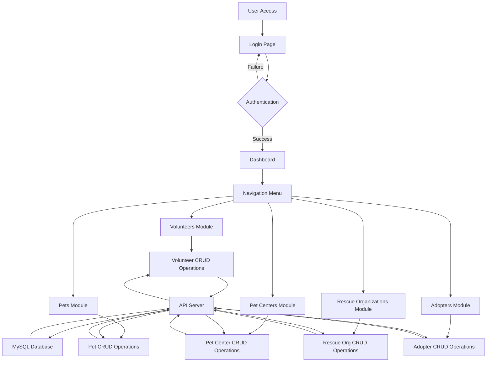
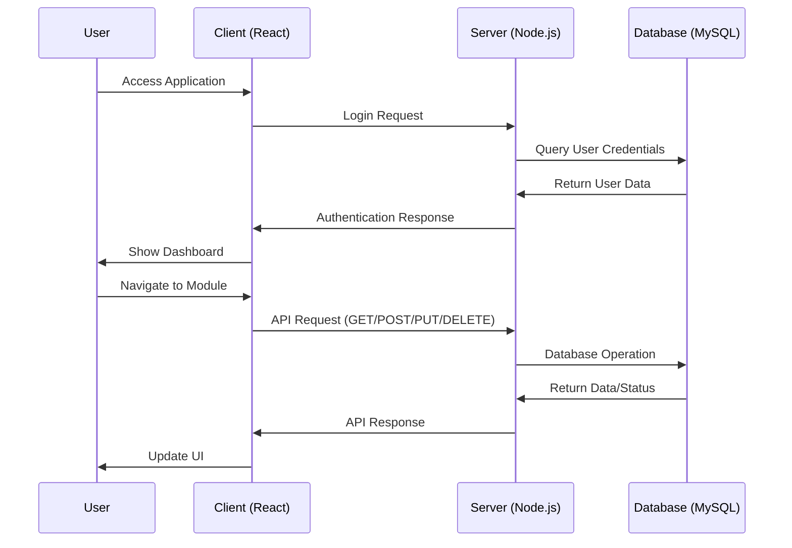
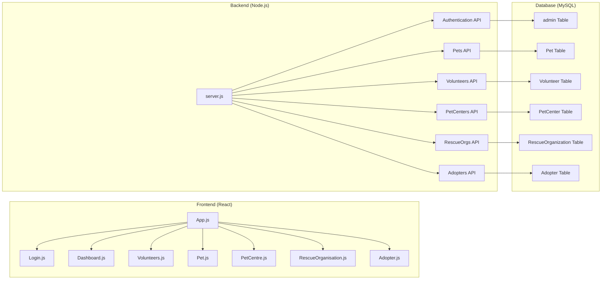
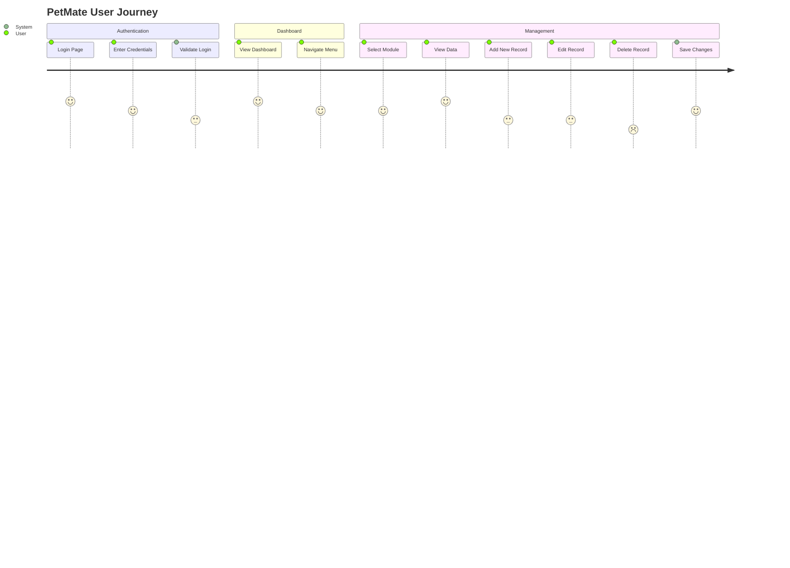
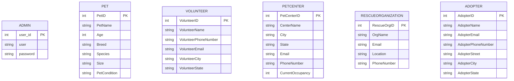
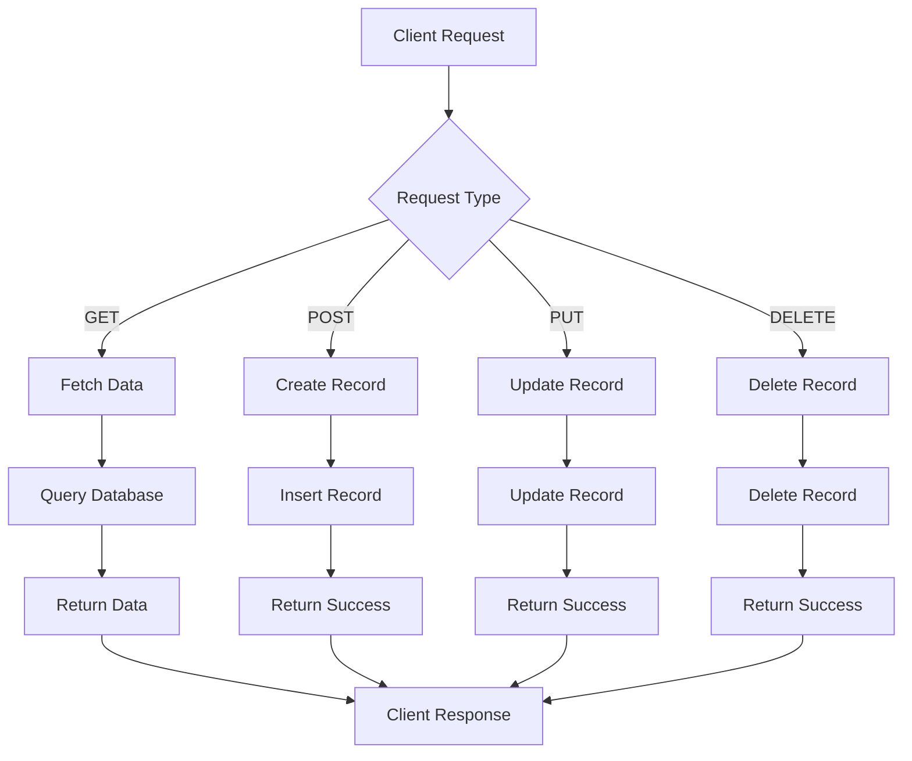

# PetMate System Flowchart

## System Architecture Flow

```mermaid
graph TD
    A[User Access] --> B[Login Page]
    B --> C{Authentication}
    C -->|Success| D[Dashboard]
    C -->|Failure| B
    D --> E[Navigation Menu]
    E --> F[Volunteers Module]
    E --> G[Pets Module]
    E --> H[Pet Centers Module]
    E --> I[Rescue Organizations Module]
    E --> J[Adopters Module]
    
    F --> K[Volunteer CRUD Operations]
    G --> L[Pet CRUD Operations]
    H --> M[Pet Center CRUD Operations]
    I --> N[Rescue Org CRUD Operations]
    J --> O[Adopter CRUD Operations]
    
    K --> P[API Server]
    L --> P
    M --> P
    N --> P
    O --> P
    
    P --> Q[MySQL Database]
    Q --> P
    P --> K
    P --> L
    P --> M
    P --> N
    P --> O
```

## Data Flow Diagram

```mermaid
sequenceDiagram
    participant U as User
    participant C as Client (React)
    participant S as Server (Node.js)
    participant D as Database (MySQL)
    
    U->>C: Access Application
    C->>S: Login Request
    S->>D: Query User Credentials
    D->>S: Return User Data
    S->>C: Authentication Response
    C->>U: Show Dashboard
    
    U->>C: Navigate to Module
    C->>S: API Request (GET/POST/PUT/DELETE)
    S->>D: Database Operation
    D->>S: Return Data/Status
    S->>C: API Response
    C->>U: Update UI
```

## Component Architecture

```mermaid
graph LR
    subgraph "Frontend (React)"
        A[App.js] --> B[Login.js]
        A --> C[Dashboard.js]
        A --> D[Volunteers.js]
        A --> E[Pet.js]
        A --> F[PetCentre.js]
        A --> G[RescueOrganisation.js]
        A --> H[Adopter.js]
    end
    
    subgraph "Backend (Node.js)"
        I[server.js] --> J[Authentication API]
        I --> K[Pets API]
        I --> L[Volunteers API]
        I --> M[PetCenters API]
        I --> N[RescueOrgs API]
        I --> O[Adopters API]
    end
    
    subgraph "Database (MySQL)"
        P[admin Table]
        Q[Pet Table]
        R[Volunteer Table]
        S[PetCenter Table]
        T[RescueOrganization Table]
        U[Adopter Table]
    end
    
    J --> P
    K --> Q
    L --> R
    M --> S
    N --> T
    O --> U
```

## User Journey Flow

```mermaid
journey
    title PetMate User Journey
    section Authentication
      Login Page: 5: User
      Enter Credentials: 4: User
      Validate Login: 3: System
    section Dashboard
      View Dashboard: 5: User
      Navigate Menu: 4: User
    section Management
      Select Module: 4: User
      View Data: 5: User
      Add New Record: 3: User
      Edit Record: 3: User
      Delete Record: 2: User
      Save Changes: 4: System
```

## Database Schema Relationship

```mermaid
erDiagram
    ADMIN {
        int user_id PK
        string user
        string password
    }
    
    PET {
        int PetID PK
        string PetName
        int Age
        string Breed
        string Species
        string Size
        string PetCondition
    }
    
    VOLUNTEER {
        int VolunteerID PK
        string VolunteerName
        string VolunteerPhoneNumber
        string VolunteerEmail
        string VolunteerCity
        string VolunteerState
    }
    
    PETCENTER {
        int PetCenterID PK
        string CenterName
        string City
        string State
        string Email
        string PhoneNumber
        int CurrentOccupancy
    }
    
    RESCUEORGANIZATION {
        int RescueOrgID PK
        string OrgName
        string Email
        string Location
        string PhoneNumber
    }
    
    ADOPTER {
        int AdopterID PK
        string AdopterName
        string AdopterEmail
        string AdopterPhoneNumber
        string AdopterStreet
        string AdopterCity
        string AdopterState
    }
```

## API Endpoints Flow

```mermaid
graph TD
    A[Client Request] --> B{Request Type}
    
    B -->|GET| C[Fetch Data]
    B -->|POST| D[Create Record]
    B -->|PUT| E[Update Record]
    B -->|DELETE| F[Delete Record]
    
    C --> G[Query Database]
    D --> H[Insert Record]
    E --> I[Update Record]
    F --> J[Delete Record]
    
    G --> K[Return Data]
    H --> L[Return Success]
    I --> M[Return Success]
    J --> N[Return Success]
    
    K --> O[Client Response]
    L --> O
    M --> O
    N --> O
```
